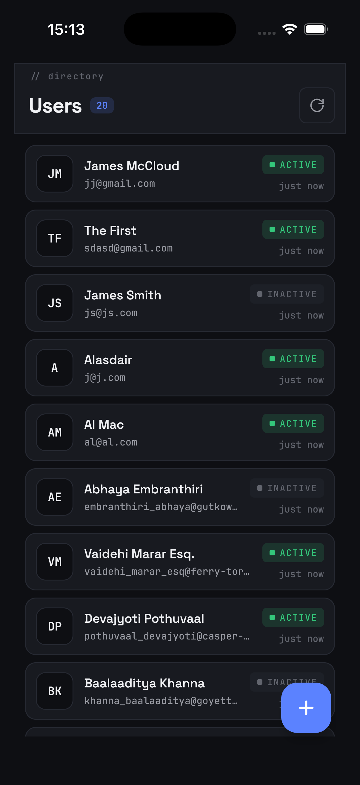
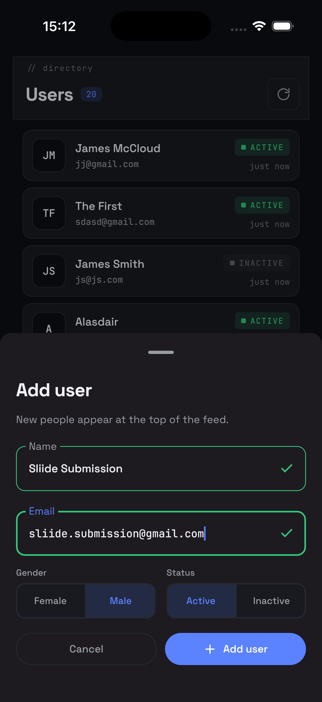
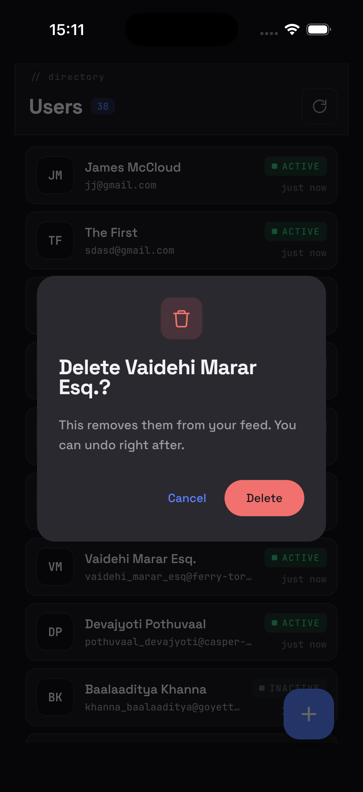
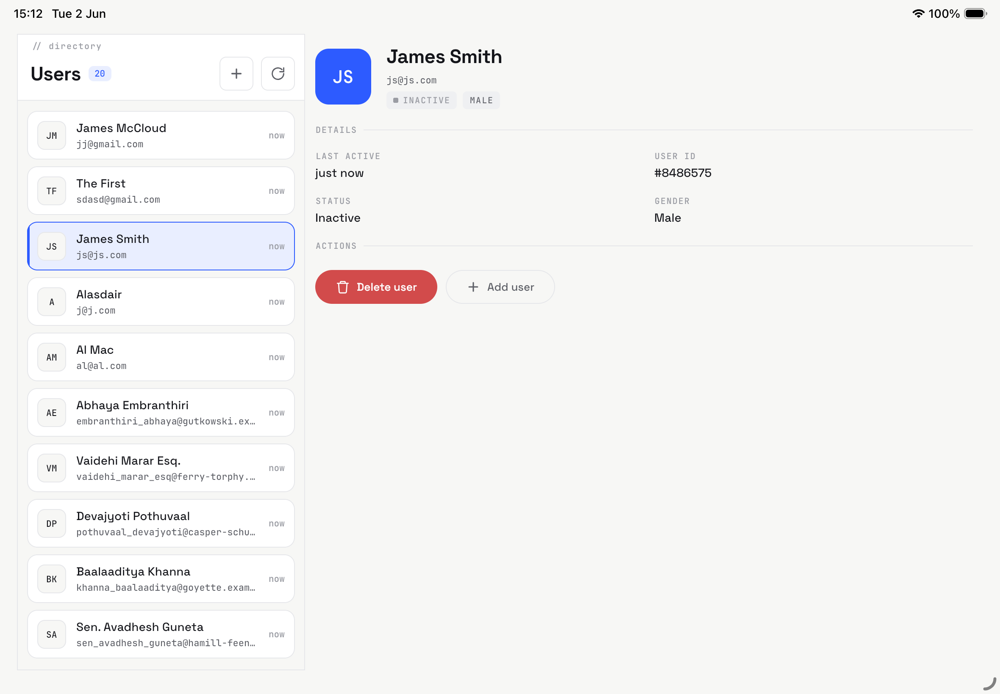

# Sliide Peek

A polished, offline-capable **user-management app** built with Kotlin Multiplatform and Compose Multiplatform — one shared codebase running on Android and iOS, talking to the GoREST `/users` API. Built for the Sliide KMP "UX Innovator" challenge.

## Screenshots

<table>
  <tr>
    <td></td>
    <td></td>
    <td></td>
  </tr>
  <tr>
    <td align="center">Smart feed (dark)</td>
    <td align="center">Add user — live validation</td>
    <td align="center">Delete confirmation</td>
  </tr>
  <tr>
    <td colspan="3"></td>
  </tr>
  <tr>
    <td align="center" colspan="3">Tablet master-detail (light)</td>
  </tr>
</table>

Phone shots are the dark theme; the tablet master-detail shot is the light theme.

## What the app does

- **Smart user feed** — name, email, and a relative timestamp ("5 min ago"), with shimmer loading and distinct empty / API-error / offline states.
- **Add user** — a FAB opens a polished form with real-time name and email validation; on success the new user appears at the top of the feed instantly.
- **Delete with Undo** — long-press to confirm; the row animates out and a Snackbar offers Undo, restoring it if you change your mind.
- **Works offline** — previously loaded users are cached locally (SQLDelight) and shown when the network is unavailable, with pull-to-refresh and pagination.
- **Adapts to the screen** — a single list on phones, a master-detail layout on tablets and in landscape.
- **Feels expensive** — Material 3, light/dark themes, and motion throughout.

## A note on the "latest page" feed

The challenge brief asks for the **last page** of `/users`. In practice GoREST returns the *newest* users on page 1 and the oldest on the final page — so literally fetching the last page would surface the least relevant users. To match the intent of a "smart feed", Sliide Peek treats **page 1 as the latest-user feed**. This is a deliberate product decision, called out here so it doesn't read as a misunderstanding of the spec.

## AI-driven development

This app was built with an AI development workflow, with me directing and curating throughout rather than handing the build off wholesale.

The process was structured around a **high-level roadmap**, and each roadmap item went through two phases:

1. **Plan** — work the item up into a concrete implementation plan.
2. **Implement** — build that plan, then verify with builds, shared unit tests, and review before moving to the next item.

The work used a mix of two AI tools across both phases — [Pi](https://pi.dev) using GPT-5.5 and [Claude Code](https://claude.com/claude-code) using 4.8 Opus.

Both phases run on a set of **reusable skills I've curated over time**, not prompts written for this project: a dedicated workflow skill for each phase (planning and implementation), plus **KMP-focused skills** for Compose UI, networking, state, and testing. They encode how I like KMP apps built, so the AI's output lands close to my conventions from the start. The skills live in [`.agents/skills/`](.agents/skills/).

The whole workflow was orchestrated by a single AI orchestration, and it could have been run fully autonomously, hands-off. I deliberately didn't. The challenge brief is light on product detail — it lists the must-have features but leaves most of the actual product decisions open — and handing that much ambiguity to a fully autonomous run would, I think, have produced a weak product. Keeping a human in the loop let me steer the *product* — what to build and how it should feel — at each step, much more than the implementation itself. The orchestration was AI-driven; the product direction and curation were mine.

The app's **visual design** was produced using Claude Code's design tool. The resulting UX flows and high-fidelity canvases live in [`design/`](design/) — see [Design](#design) below.

> ### 📂 [AI-assisted development log →](docs/ai/README.md)
> ### 📊 [Rendered session transcripts →](docs/ai/README.md#pi-session-exports)
> Rendered transcripts open in the browser via raw.githack.com; raw JSONL is also included for transparency.

## Design

Design artifacts from Claude Code's design tool:

- [`design/ux_v2.html`](design/ux_v2.html) — UX structure and flow.
- [`design/high-fidelity-ui.html`](design/high-fidelity-ui.html) — high-fidelity UI canvas.
- [`design/design_engineering_spec.html`](design/design_engineering_spec.html) — behaviour, state, validation, copy, accessibility.
- [`design/design_tokens_and_handoff.html`](design/design_tokens_and_handoff.html) — tokens, components, typography, spacing, motion.

## Under the hood

Architecture, KMP `expect`/`actual` usage, project layout, and build/run instructions are in [`docs/ARCHITECTURE.md`](docs/ARCHITECTURE.md).
